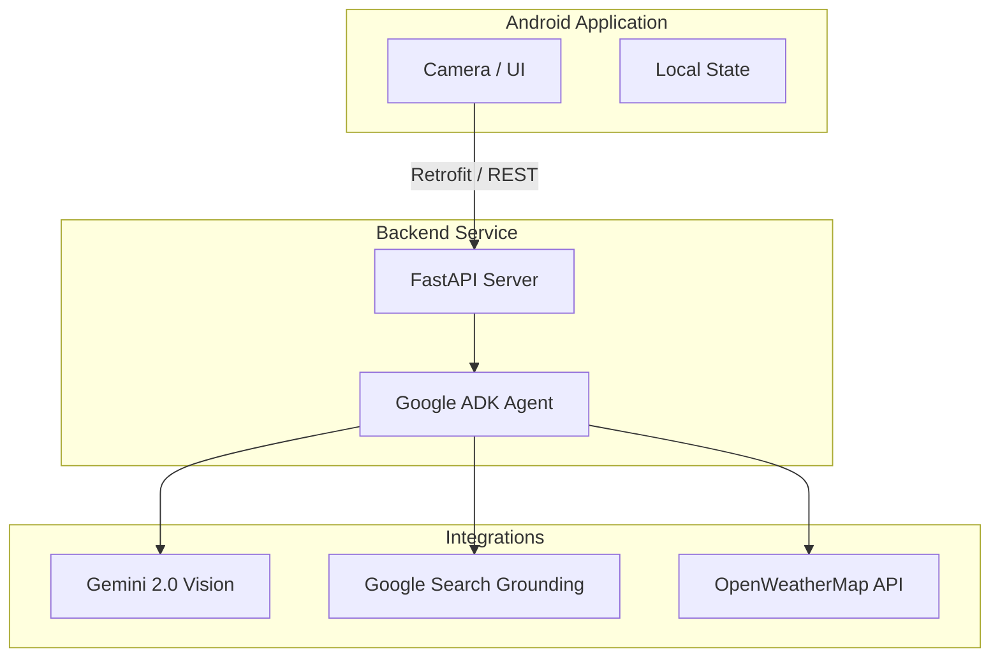

# 🌟 Aura — Your AI Fashion Stylist 👗✨


<p align="center">
  <strong>Aura</strong> is a next-generation AI-powered fashion stylist designed to help users curate, style, and perfect their daily outfits. By leveraging the power of live camera feeds, contextual weather data, and real-time multimodal AI analysis, Aura transforms your wardrobe into a personalized fashion boutique.
</p>

---

## 📖 Description

Choosing the perfect outfit is often a time-consuming challenge influenced by trends, weather, personal taste, and occasion. 
Aura solves this by providing **live, actionable styling advice**. Acting as a pocket-sized personal stylist, Aura analyzes the user's current attire through real-time camera capture. It intelligently factors in local weather conditions and recent fashion trends to offer personalized, contextual feedback. 

With deep integration of **Gemini 2.0 Vision** and **Google Search grounding**, Aura not only suggests aesthetic improvements but also helps users discover and shop for complementary items that complete their look.

*Originally built for the **NYC Build With AI Hackathon — "Live Agents" category**.*

---

## ✨ Key Features

- **📸 Live Camera Analysis:** Integrates seamless Android CameraX capture to provide instant, multimodal feedback on your current style.
- **🧠 Intelligent Outfit Detection:** Utilizes Gemini 2.0 Vision to identify clothing types, colors, textures, and overall style aesthetics with high precision.
- **🌤️ Weather-Aware Context:** Connects to live weather services (OpenWeatherMap) to ensure all styling recommendations are practical for your exact location and climate.
- **🛍️ Real Product Recommendations:** Powered by Google Search grounding (ADK), Aura discovers real-world, purchasable items that perfectly complement your outfit.
- **💬 Conversational AI Stylist:** A natural, multi-turn conversational interface that maintains context, allowing for dynamic and iterative style adjustments.
- **📚 Continuous Learning Memory:** Securely remembers past outfits, preferences, and feedback to provide increasingly personalized and varied suggestions over time.

---

## 🏗️ Architecture

Aura operates on a robust, scalable architecture seamlessly bridging a high-performance Android client with a heavily optimized Python backend.



---

## 🛠️ Tech Stack

### Mobile Client (Android)
- **Language:** Kotlin
- **UI Framework:** Jetpack Compose
- **Camera:** CameraX
- **Networking:** Retrofit, OkHttp

### Backend Service (Cloud Run)
- **Framework:** Python, FastAPI
- **AI Agent:** Google Agent Development Kit (ADK)
- **Deployment:** Docker, Google Cloud Run

### Integrations
- **AI Engine:** Google Gemini 2.0 Flash (Multimodal)
- **Data Enrichment:** OpenWeatherMap API, Google Search

---

## 🚀 Getting Started

Follow these instructions to set up Aura locally for development and testing.

### Prerequisites
- [Android Studio](https://developer.android.com/studio) (latest stable version)
- Python 3.9+
- A Google Gemini API Key ([Get it here](https://aistudio.google.com))
- An OpenWeatherMap API Key ([Get it here](https://openweathermap.org/api))

### 1. Backend Setup

```bash
# Navigate to the backend directory
cd backend

# Create and activate a pristine virtual environment
python -m venv .venv
source .venv/bin/activate  # On Windows use: .venv\Scripts\activate

# Install core dependencies
pip install -r requirements.txt

# Configure your environment variables
echo "GOOGLE_GENAI_API_KEY=your-gemini-key" > aura_agent/.env
echo "OPENWEATHER_API_KEY=your-weather-key" >> aura_agent/.env

# Launch the FastAPI development server
uvicorn server:app --port 8080 --reload
```

*To deploy for production, use the included deployment script:*
```bash
chmod +x deploy.sh && ./deploy.sh
```

### 2. Android App Setup

1. **Clone the repository:**
   ```bash
   git clone https://github.com/shachafha/Aura.git
   ```
2. Open the project in **Android Studio**.
3. Create or update your `local.properties` file in the root directory to include:
   ```properties
   GEMINI_API_KEY=your-gemini-key
   ```
4. **Sync Gradle** and run the app on a physical Android device (a real device is highly recommended to fully test the CameraX integration).

---

## 📚 Documentation

Dive deeper into our technical documentation and team guidelines:
- [System Architecture](docs/ARCHITECTURE.md) — Detailed schema of system design and data flow.
- [Team Skills & Allocation](docs/TEAM_SKILLS.md) — Module ownership and internal API contracts.
- [Hackathon Brief](docs/HACKATHON_BRIEF.md) — The original competition context and scope.
- [Demo Script](docs/DEMO_SCRIPT.md) — 5-minute definitive presentation guide.

---

## 🤝 The Team

Engineered with passion by:
- **Ayush Verma**
- **Shachaf Rispler**
- **Sayra Kurtoglu**
- **Manuel Manalo**

---

## 📄 License & Legal

Aura is currently available for evaluation and educational purposes as part of the NYC Build With AI Hackathon. 

---
<p align="center">
  <i>Step out with confidence. Let Aura be your guide.</i>✨
</p>
